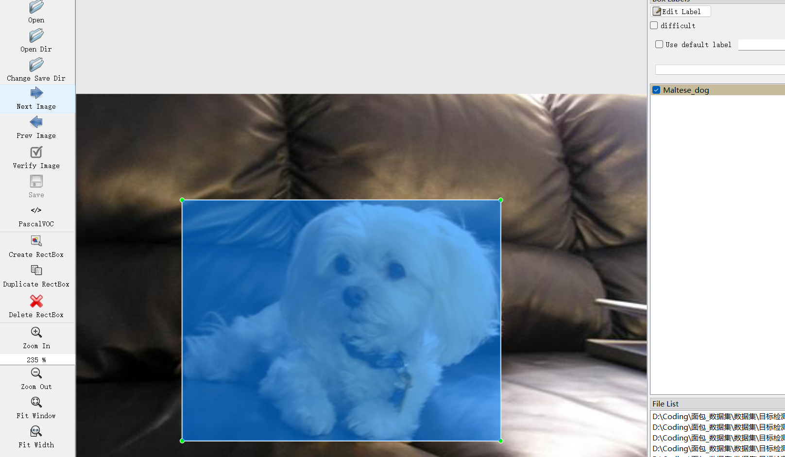

# Dog Detection Dataset

Dataset Information: There are 20,580 images and corresponding annotation files.

The annotation file format includes two types, including the VOC format's xml file and the YOLO format's txt file.

The objects to be labeled include the following:

1. Chihuahua
2. Japanese_spaniel
3. Maltese_dog
4. Pekinese
5. Shih-Tzu
6. Blenheim_spaniel
7. papillon
8. toy_terrier
9. Rhodesian_ridgeback
10. Afghan_hound
11. basset
12. beagle
13. bluetick
14. black-and-tan_coonhound
15. Walker_hound
16. English_foxhound
17. redbone
18. borzoi
19. Irish_wolfhound
20. Italian_greyhound
21. whippet
22. Ibizan_hound
23. Norwegian_elkhound
24. otterhound
25. Saluki
26. Scottish_deerhound
27. Weimaraner
28. Staffordshire_bullterrier
29. American_Staffordshire_terrier
30. Bedlington_terrier
31. Border_terrier
32. Kerry_blue_terrier
33. Irish_terrier
34. Norfolk_terrier
35. Norwich_terrier
36. Yorkshire_terrier
37. wire-haired_fox_terrier
38. Lakeland_terrier
39. Sealyham_terrier
40. Airedale
41. cairn
42. Australian_terrier
43. Dandie_Dinmont
44. Boston_bull
45. miniature_schnauzer
46. giant_schnauzer
47. standard_schnauzer
48. Scotch_terrier
49. Tibetan_terrier
50. silky_terrier
51. soft-coated_wheaten_terrier
52. West_Highland_white_terrier
53. Flat-coated_retriever
54. curly-coated_retriever
55. golden_retriever
56. Labrador_retriever
57. Chesapeake_Bay_retriever
58. German_short-haired_pointer
59. vizsla
60. English_setter
61. Irish_setter
62. Gordon_setter
63. Brittany_spaniel
64. clumber
65. English_springer
66. Welsh_springer_spaniel
67. cocker_spaniel
68. Sussex_spaniel
69. Irish_water_spaniel
70. kuvasz
71. groenendael
72. malamute
73. briard
74. boxer
75. bull_mastiff
76. Tibetan_mastiff
77. EntleBucher
78. boxer
79. boxer
80. boxer
81. boxer
82. boxer
83. boxer
84. boxer
85. boxer
86. boxer
87. boxer
88. boxer
89. boxer
90. boxer
91. boxer
92. boxer
93. boxer
94. boxer
95. boxer
96. boxer
97. boxer
98. boxer
99. boxer
100. boxer
101. boxer
102. boxer
103. boxer
104. boxer
105. boxer
106. Boxer
107. Boxer
108. Boxer
109. Boxer
110. Boxer
111. Boxer
112. Boxer
113. Boxer
114. Boxer
115. Boxer
116. Boxer
117. Boxer
118. Boxer
119. Boxer
120. Boxer
121. Boxer (Boxer)
122. Boxer (Boxer)
123. Boxer (Boxer)
124. Boxer (Boxer)
125. Boxer (Boxer)
126. Boxer (Boxer)
127. Boxer (Boxer)
128. Boxer (Boxer)
129. Boxer (Boxer)
130. Boxer (Boxer)
131. Boxer (Boxer)
132. Boxer (Boxer)
133. Boxer (Boxer)
134. Boxer (Boxer)
135. Boxer (Boxer)
136. Boxer (Boxer)
137. Boxer (Boxing File)
## Images

Here is a pay link on Stripe ( https://buy.stripe.com/3cs8yP7sY87d0vu9AB ). Please contact me lonlonago@foxmail.com after funding $89, and I will send you a complete data files , thank you!

